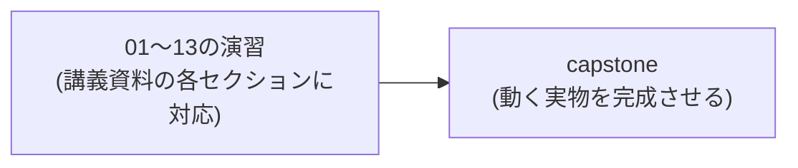

JavaScript演習問題集
================================================================================

このリポジトリは、講義資料「JavaScript入門 ― 基礎から実践まで」（`10.javascript.md`）の内容を、
実際に手を動かしながら復習するための演習問題集です。

この演習のゴール
--------------------------------------------------------------------------------

- 講義資料の各セクションに対応する小さな演習（`exercises/`）を1つずつ完成させることで、
  内容を網羅的に復習します。
- 最終的に `capstone/` で、これまでの演習の知識を組み合わせた
  **「メンバー一覧をAPIから取得して画面に表示する、実際に動くミニアプリ」** を完成させます。

進め方
--------------------------------------------------------------------------------

1. `exercises/` 内の演習を、番号順に進めてください。
2. 各演習フォルダの `README.md` に、課題内容と講義資料の該当セクションが書かれています。
   分からなくなったら、まず該当セクションを読み返しましょう。
3. `todo.js`（または `index.html` + `todo.js`）内の `// TODO` 部分を実装してください。
4. 実装できたら、以下のいずれかの方法で確認します。
   - **自動採点があるもの**: ターミナルで `node exercises/番号-名前/check.js` を実行する
   - **ブラウザ確認が必要なもの**（DOM操作を含む演習）: プロジェクトルートで `npx serve .` を実行し、
     ブラウザで該当フォルダの `index.html` を開いて動作を確認する
5. どうしても分からない場合は、`answer/` フォルダの模範解答を確認してください。
   ただし、**先に自分で試行錯誤することが最も重要です。**

演習一覧
--------------------------------------------------------------------------------

| No | フォルダ | テーマ | 講義資料の該当セクション | 確認方法 |
|----|---------|--------|------------------------|---------|
| 01 | `exercises/01-variables-types` | 変数と型の基礎 | 変数と型の基礎 | `node check.js` |
| 02 | `exercises/02-equality` | 等価演算子 | 等価演算子 | `node check.js` |
| 03 | `exercises/03-functions` | 関数の定義 | 関数の定義 | `node check.js` |
| 04 | `exercises/04-scope-closure` | スコープとクロージャ | スコープとクロージャ | `node check.js` |
| 05 | `exercises/05-this` | thisの挙動 | thisの挙動 | `node check.js` |
| 06 | `exercises/06-falsy-nullish` | 偽値とNullish | 偽値（Falsy）とNullish | `node check.js` |
| 07 | `exercises/07-operators` | スプレッド・分割代入 | 演算子 | `node check.js` |
| 08 | `exercises/08-array-methods` | 配列操作 | 配列操作 | `node check.js` |
| 09 | `exercises/09-object-copy` | オブジェクト操作 | オブジェクト操作 | `node check.js` |
| 10 | `exercises/10-async-await` | 非同期処理 | 非同期処理 | `node check.js` |
| 11 | `exercises/11-dom-api` | DOM API | DOM API | ブラウザで確認 |
| 12 | `exercises/12-module` | モジュール | モジュール | `node check.js` |
| 13 | `exercises/13-security-xss` | セキュリティ意識 | セキュリティ意識 | ブラウザで確認 |
| - | `capstone/` | 総合演習（動く実物） | fetch実践 ほか全体 | ブラウザで確認 |

演習08・09・10・11・13は、`capstone/`の実装で再利用する関数です。
ここで書いた関数がそのまま最終成果物の一部になります。

事前準備
--------------------------------------------------------------------------------

- Node.js（18以降推奨。`fetch`がネイティブで使えるバージョン）
- ブラウザで確認する演習では、`npx serve .` でローカルサーバーを起動してください
  （`file://`で直接開くと`fetch`やモジュールが動作しません）。
