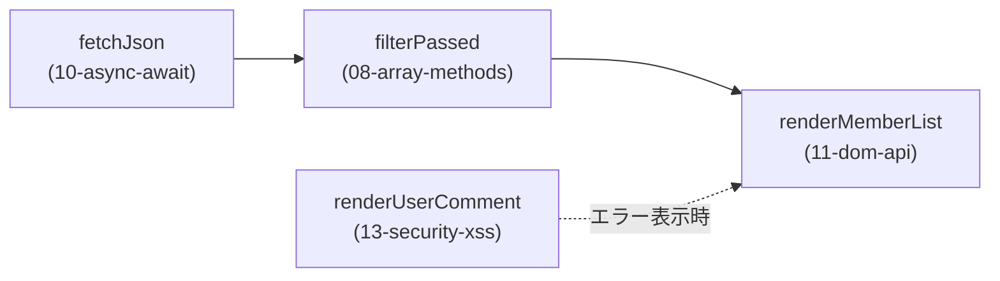

キャップストーン: メンバー一覧アプリ
================================================================================

これまでの演習（01〜13）の集大成です。
`members.json`をAPIに見立てて取得し、検索・絞り込みができるメンバー一覧画面を完成させます。



**この`main.js`は、演習08・10・11・13で実装した関数をそのままインポートして使います。**
先に該当する演習を完成させてから取り組んでください。


課題
--------------------------------------------------------------------------------

`main.js`の以下の部分を実装してください。

1. `init()`関数内で、`fetchJson("./members.json")`を使って一覧データを取得し、
   `allMembers`に保存してください。取得に失敗した場合は`catch`でエラーを捕まえ、
   `renderUserComment`を使って`#error`にエラーメッセージを安全に表示してください。

2. `applyFiltersAndRender()`関数を実装してください。
   - 検索欄（`#search-input`）に入力された文字列で、メンバーの名前を絞り込む
   - 「合格者のみ表示」チェックボックス（`#passed-only-checkbox`）がオンの場合、
     `filterPassed`を使ってさらに絞り込む（合格基準は`PASSING_SCORE`）
   - 絞り込んだ結果を`renderMemberList`で`#member-list`に描画する
   - `#summary`に「表示件数」などの簡単なサマリーを表示する


確認方法
--------------------------------------------------------------------------------

1. リポジトリのルートで以下を実行します。

   ```bash
   npx serve .
   ```

2. ブラウザで`http://localhost:3000/capstone/`を開きます。
3. メンバー一覧が表示され、検索欄への入力やチェックボックスの操作で
   一覧がリアルタイムに絞り込まれれば成功です。

どうしても分からない場合は、`answer/`フォルダの模範解答を確認してください。
