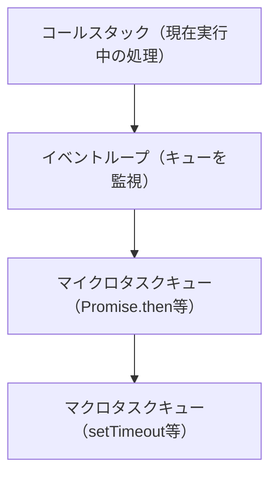

JavaScript入門 ― 基礎から実践まで
================================================================================

この資料では、HTML/CSSを習得済みの方を対象に、JavaScriptの基礎から実践的な内容までを体系的に学習します。


目次
--------------------------------------------------------------------------------

1. [開発環境の準備](#開発環境の準備)
2. [変数と型の基礎](#変数と型の基礎)
3. [等価演算子](#等価演算子)
4. [関数の定義](#関数の定義)
5. [スコープとクロージャ](#スコープとクロージャ)
6. [thisの挙動](#thisの挙動)
7. [偽値（Falsy）とNullish](#偽値falsy)
8. [演算子](#演算子)
9. [配列操作](#配列操作)
10. [オブジェクト操作](#オブジェクト操作)
11. [非同期処理](#非同期処理)
12. [イベントループ](#イベントループ)
13. [DOM API](#dom-api)
14. [モジュール](#モジュール)
15. [fetch実践](#fetch実践)
16. [デバッグの基本](#デバッグの基本)
17. [セキュリティ意識](#セキュリティ意識)

開発環境の準備
================================================================================

JavaScriptを学習・開発するための環境を整えましょう。


ブラウザの開発者ツール（DevTools）
--------------------------------------------------------------------------------

モダンブラウザには強力な開発者ツールが組み込まれています。
Chrome、Firefox、Edge、Safari等で利用可能です。ここではChromeを例に説明します。

### 開き方

- Windows/Linux: `F12` または `Ctrl + Shift + I`
- Mac: `Cmd + Option + I`
- 右クリック → 「検証」

### 主要なタブ

| タブ              | 用途                             |
|-----------------|--------------------------------|
| **Elements**    | HTML/CSSの確認・編集                 |
| **Console**     | JavaScriptの実行、ログ出力の確認          |
| **Sources**     | ソースコードの確認、ブレークポイントの設定          |
| **Network**     | 通信の監視（API呼び出しの確認）              |
| **Application** | ストレージ（Cookie、LocalStorage等）の確認 |

Consoleタブでの練習
--------------------------------------------------------------------------------

DevToolsのConsoleタブでは、JavaScriptをその場で実行できます。
学習中はConsoleで動作を確認しながら進めましょう。

```javascript
// Consoleに入力して実行してみましょう
console.log("Hello, JavaScript!")
1 + 2 * 3
"Hello".toUpperCase()
```

簡易ローカルサーバの起動
--------------------------------------------------------------------------------

ファイルをダブルクリックして開く（`file://`プロトコル）では、セキュリティ制限により一部の機能が動作しません。
ローカルサーバを使用することで、本番環境に近い状態で開発できます。

IntelliJ IDEAのターミナル（画面下部の「Terminal」タブ）を開き、以下のコマンドを実行してください。

```bash
# プロジェクトのルートディレクトリで実行
npx serve .
```

起動すると`http://localhost:3000`でアクセスできます。
停止するには`Ctrl + C`を押してください。

変数と型の基礎
================================================================================

let / const / var
--------------------------------------------------------------------------------

変数を宣言するには`let`、`const`、`var`の3つのキーワードがあります。
**現代のJavaScriptでは`let`と`const`を使用し、`var`は使わないでください。**

### const（推奨）

再代入できない変数を宣言します。基本的にはこちらを使用してください。

```javascript
const name = "Alice"
name = "Bob" // エラー: 再代入不可

// ただし、オブジェクトや配列の中身は変更できます
const user = {name: "Alice"}
user.name = "Bob" // OK（オブジェクト自体の再代入ではない）
```

### let

再代入が必要な場合に使用します。

```javascript
let count = 0
count = count + 1 // OK
```

### var（非推奨）

`var`は古いJavaScriptの構文で、以下の問題があるため**使用しないでください**。

```javascript
// 問題1: 関数スコープ（ブロックスコープではない）
if (true) {
    var x = 10
}
console.log(x) // 10 が出力される（ブロック外でもアクセス可能）

// let の場合
if (true) {
    let y = 10
}
console.log(y) // エラー: y is not defined

// 問題2: 重複宣言が可能（バグの原因）
var name = "Alice"
var name = "Bob" // エラーにならない！

let name2 = "Alice"
let name2 = "Bob" // エラー: 再宣言不可

// 問題3: ホイスティング（巻き上げ）
console.log(z) // undefined（エラーではない）
var z = 10
```

基本型（プリミティブ型）
--------------------------------------------------------------------------------

JavaScriptには以下の基本型があります。

| 型           | 説明          | 例                                      |
|-------------|-------------|----------------------------------------|
| `string`    | 文字列         | `"Hello"`, `'World'`, `` `Template` `` |
| `number`    | 数値（整数・小数）   | `42`, `3.14`, `NaN`, `Infinity`        |
| `boolean`   | 真偽値         | `true`, `false`                        |
| `null`      | 意図的な「値なし」   | `null`                                 |
| `undefined` | 未定義         | `undefined`                            |
| `symbol`    | 一意の識別子      | `Symbol("id")`                         |
| `bigint`    | 巨大整数        | `9007199254740991n`                    |
| `object`    | オブジェクト（参照型） | `{}`, `[]`, `function(){}`             |

### typeof演算子

変数の型を確認するには`typeof`演算子を使用します。

```javascript
typeof "Hello"     // "string"
typeof 42          // "number"
typeof true        // "boolean"
typeof undefined   // "undefined"
typeof null        // "object" ← 歴史的なバグ（本来は"null"であるべき）
typeof {}          // "object"
typeof []          // "object" ← 配列もobject
typeof function () {
} // "function"
```

### nullとundefinedの違い

```javascript
// undefined: 値が設定されていない状態
let a
console.log(a) // undefined

// null: 意図的に「値がない」ことを示す
let b = null
console.log(b) // null

// 使い分けの目安
// - undefined: 言語が自動的にそうする状態（プログラマが意図していない）
// - null: プログラマが意図的に「値がない」ことを表現する
```

つまり、**undefinedは「まだ何も起きていない」状態**、**nullは「ないと分かっている」状態**です。

```javascript
// --- undefinedになる場面（言語が勝手にそうする） ---

// 変数を宣言しただけで何も入れていない
let userData
console.log(userData) // undefined

// オブジェクトに存在しないプロパティにアクセス
const config = { host: "localhost", port: 3000 }
console.log(config.timeout) // undefined（設定されていない）

// 関数の引数が渡されなかった
function greet(name) {
    console.log(name) // undefined（呼び出し側が渡し忘れた）
}
greet()


// --- nullを使う場面（プログラマが意図的にそうする） ---

// ログイン前の状態を明示する
const currentUser = null // 「ユーザーがいない」ことを表現

// 検索したが結果が見つからなかった
function findUser(id) {
    const user = database.find(u => u.id === id)
    return user ?? null // 「探したけど無かった」を明示的に返す
}

// フォームで「まだ何も選んでいない」ことを表現する
const selectedOption = null
```


### NaN（Not a Number）

`NaN`は「数値ではない」ことを表す特殊な数値です。
数値演算が失敗した場合などに発生します。

```javascript
console.log(typeof NaN)  // "number"（数値型であることに注意）

// NaNが発生する例
console.log(0 / 0)            // NaN
console.log(parseInt("abc"))  // NaN
console.log(Number("hello"))  // NaN
console.log(Math.sqrt(-1))    // NaN
```

**重要: `NaN`は自分自身と等しくならない唯一の値です。**

```javascript
console.log(NaN === NaN) // false（！）
console.log(NaN == NaN)  // false（！）
```

そのため、`NaN`かどうかを判定するには専用の関数を使用します。

```javascript
// Number.isNaN()（推奨）: 引数が本当にNaNかどうかを判定
console.log(Number.isNaN(NaN))       // true
console.log(Number.isNaN(123))       // false
console.log(Number.isNaN("hello"))   // false（文字列はNaNではない）
console.log(Number.isNaN(undefined)) // false

// isNaN()（非推奨）: 引数を数値に変換してから判定するため、誤判定が起きる
console.log(isNaN(NaN))       // true
console.log(isNaN("hello"))   // true（！ 文字列を数値変換→NaN→trueになる）
console.log(isNaN(undefined)) // true（！ undefinedを数値変換→NaN→trueになる）
```

**結論:** NaNの判定には必ず`Number.isNaN()`を使用してください。


### 型変換（型強制）

JavaScriptでは異なる型同士の演算時、**暗黙の型変換（型強制）**が起きる場合もあります。
バグの原因になりやすいため、仕組みを理解しておくことが重要です。

#### 暗黙の型変換

```javascript
// 文字列連結（+演算子は文字列が優先される）
console.log("3" + 2)    // "32"（数値が文字列に変換される）
console.log(1 + "2" + 3) // "123"

// 算術演算（+以外は数値が優先される）
console.log("6" - 2)   // 4（文字列が数値に変換される）
console.log("6" * 2)   // 12
console.log("6" / 2)   // 3

// 比較（==は型変換してから比較する）
console.log(1 == "1")    // true
console.log(0 == false)  // true
console.log("" == false) // true

// 論理演算
console.log(!0)    // true（0はFalsy）
console.log(!"")   // true（空文字はFalsy）
console.log(!null) // true（nullはFalsy）
```

#### 明示的な型変換

暗黙の型変換に頼らず、意図を明確にして**明示的な型変換**を使いましょう。

```javascript
// 数値への変換
Number("42")      // 42
Number("3.14")    // 3.14
Number("")        // 0
Number("abc")     // NaN
Number(true)      // 1
Number(false)     // 0
Number(null)      // 0
Number(undefined) // NaN

// 整数への変換（文字列の先頭から数値を読み取る）
parseInt("42px")    // 42（"px"は無視される）
parseInt("0xFF", 16) // 255（16進数として解釈）
parseInt("abc")     // NaN

// 小数への変換
parseFloat("3.14")     // 3.14
parseFloat("3.14.159") // 3.14（2つ目の小数点以降は無視）

// 文字列への変換
String(42)        // "42"
String(true)      // "true"
String(null)      // "null"
String(undefined) // "undefined"

// 真偽値への変換
Boolean(1)     // true
Boolean(0)     // false
Boolean("")    // false
Boolean("abc") // true
Boolean(null)  // false
Boolean({})    // true（空オブジェクトもtrue）
Boolean([])    // true（空配列もtrue）
```

**よくある落とし穴:**

```javascript
// + を使った数値変換（簡潔だが可読性に注意）
+"42"   // 42
+""     // 0
+true   // 1
+null   // 0

// テンプレートリテラルによる文字列変換
`${42}` // "42"
```


等価演算子
================================================================================

JavaScriptには2種類の等価演算子があります。

**原則として`===`（厳密な等価演算子）を使用してください。**


== vs ===
--------------------------------------------------------------------------------

### ==（等価演算子）

型変換してから比較するため、直感と異なる結果を返すことがあります。

```javascript
1 == "1"      // true（文字列が数値に変換される）
0 == false    // true
0 == ""       // true
null == undefined // true
    [] == false   // true（予想外）
    [] == ![]     // true（予想外）
```

### ===（厳密な等価演算子）

型変換せず、型と値の両方が一致する場合のみ`true`を返します。

```javascript
1 === "1"      // false
0 === false    // false
0 === ""       // false
null === undefined // false
    [] === false   // false
```

### 不等価演算子

同様に、`!=`ではなく`!==`を使用してください。

```javascript
// 非推奨
if (value != null) { ...
}

// 推奨
if (value !== null) { ...
}
```

関数の定義
================================================================================

JavaScriptには複数の関数定義方法があります。


関数宣言（Function Declaration）
--------------------------------------------------------------------------------

最も基本的な関数定義方法です。

```javascript
function greet(name) {
    return `Hello, ${name}!`
}

console.log(greet("Alice")) // "Hello, Alice!"
```

**特徴: ホイスティング**される（宣言より前でも呼び出し可能）

```javascript
console.log(add(1, 2)) // 3（エラーにならない）

function add(a, b) {
    return a + b
}
```

関数式（Function Expression）
--------------------------------------------------------------------------------

関数を変数に代入する方法です。

```javascript
const greet = function (name) {
    return `Hello, ${name}!`
}

console.log(greet("Bob")) // "Hello, Bob!"
```

**特徴:** ホイスティングされません。

```javascript
console.log(add(1, 2)) // エラー: Cannot access 'add' before initialization

const add = function (a, b) {
    return a + b
}
```

アロー関数（Arrow Function）
--------------------------------------------------------------------------------

ES6で導入された簡潔な関数構文です。**現代のJavaScriptで最もよく使われます。**

```javascript
// 基本形
const greet = (name) => {
    return `Hello, ${name}!`
}

// 引数が1つの場合、括弧を省略可能
const greet2 = name => {
    return `Hello, ${name}!`
}

// 処理が1行の場合、中括弧とreturnを省略可能
const greet3 = name => `Hello, ${name}!`

// 引数がない場合
const sayHello = () => "Hello!"

// 複数引数
const add = (a, b) => a + b
```

**重要: アロー関数は`this`の挙動が異なります**（後述）


関数定義方法の比較
--------------------------------------------------------------------------------

| 種類    | ホイスティング | `this`の束縛 | 用途            |
|-------|---------|-----------|---------------|
| 関数宣言  | される     | 動的        | メインの関数定義      |
| 関数式   | されない    | 動的        | コールバック、条件付き定義 |
| アロー関数 | されない    | 静的（レキシカル） | コールバック、簡潔な記述  |

スコープとクロージャ
================================================================================

スコープ（Scope）
--------------------------------------------------------------------------------

スコープとは、変数が参照可能な範囲のことです。

### グローバルスコープ

どこからでも参照できる変数です。**極力使用を避けてください。**

```javascript
const globalVar = "グローバル変数"

function test() {
    console.log(globalVar) // アクセス可能
}
```

### 関数スコープ

関数内で宣言された変数は、その関数内でのみ参照できます。

```javascript
function outer() {
    const localVar = "ローカル変数"
    console.log(localVar) // OK

    function inner() {
        console.log(localVar) // OK（外側のスコープにアクセス可能）
    }
}

console.log(localVar) // エラー: localVar is not defined
```

### ブロックスコープ

`let`と`const`はブロック（`{}`）内でスコープが閉じます。

```javascript
if (true) {
    const x = 10
    let y = 20
}
console.log(x) // エラー
console.log(y) // エラー
```

クロージャ（Closure）
--------------------------------------------------------------------------------

クロージャとは、関数がその外側のスコープの変数を「記憶」する仕組みです。

```javascript
function createCounter() {
    let count = 0  // この変数はクロージャによって保持される

    return function () {
        count++
        return count
    }
}

const counter = createCounter()
console.log(counter()) // 1
console.log(counter()) // 2
console.log(counter()) // 3

// 新しいカウンターを作ると、別のcount変数が作られる
const counter2 = createCounter()
console.log(counter2()) // 1
```

### クロージャの実用例

```javascript
// プライベート変数の実現
function createUser(name) {
    let age = 0  // 外部から直接アクセスできない

    return {
        getName: () => name,
        getAge: () => age,
        birthday: () => {
            age++
        }
    }
}

const user = createUser("Alice")
console.log(user.getName()) // "Alice"
console.log(user.getAge())  // 0
user.birthday()
console.log(user.getAge())  // 1
// user.age は undefined（直接アクセスできない）
```

thisの挙動
================================================================================

JavaScriptの`this`は、関数の**呼び出し方**によって値が変わります。
これはJavaなど他言語と大きく異なる点です。


呼び出し方による違い
--------------------------------------------------------------------------------

### 1. メソッドとして呼び出し → thisはそのオブジェクト

```javascript
const user = {
    name: "Alice",
    greet: function () {
        console.log(`Hello, I'm ${this.name}`)
    }
}

user.greet() // "Hello, I'm Alice" （thisはuser）
```

### 2. 普通の関数として呼び出し → thisはundefined（strictモード）またはwindow

```javascript
function showThis() {
    "use strict"
    console.log(this)
}

showThis() // undefined

// 非strictモードでは window（ブラウザ）または global（Node.js）
```

### 3. call / apply / bind → thisを明示的に指定

```javascript
function greet() {
    console.log(`Hello, I'm ${this.name}`)
}

const alice = {name: "Alice"}
const bob = {name: "Bob"}

greet.call(alice)  // "Hello, I'm Alice"
greet.call(bob)    // "Hello, I'm Bob"
greet.apply(alice) // "Hello, I'm Alice"（callと同じ）

const greetAlice = greet.bind(alice)
greetAlice() // "Hello, I'm Alice"（thisが固定される）
```

アロー関数のthis（重要）
--------------------------------------------------------------------------------

**アロー関数は独自の`this`を持たず、定義された場所の`this`を継承します。**

```javascript
const user = {
    name: "Alice",
    // 通常の関数
    greetNormal: function () {
        setTimeout(function () {
            console.log(`Hello, I'm ${this.name}`)
        }, 100)
    },
    // アロー関数
    greetArrow: function () {
        setTimeout(() => {
            console.log(`Hello, I'm ${this.name}`)
        }, 100)
    }
}

user.greetNormal() // "Hello, I'm undefined"（thisがwindowになる）
user.greetArrow()  // "Hello, I'm Alice"（thisがuserのまま）
```

**結論:** コールバック関数では基本的にアロー関数を使用しましょう。


偽値（Falsy）
--------------------------------------------------------------------------------

Javascriptには、[偽値（Falsy）](https://developer.mozilla.org/ja/docs/Glossary/Falsy)という考え方があります。

Falsyな値とは、論理演算で`false`とみなされる値のことを指します。
以下のような値が該当します。

| 値           | 型（`typeof`による評価） |
|-------------|------------------|
| `null`      | `object`         |
| `undefined` | `undefined`      |
| `false`     | `boolean`        |
| `NaN`       | `number`         |
| `0`         | `number`         |
| `-0`        | `number`         |
| `0n`        | `bigint`         |
| `""`        | `string`         |

これらの値を`if`などで除外したい場合、等価演算子やそれに類する演算子を使用する必要はありません。

例えば配列が存在するかどうかを確認したい場合、以下のような実装は冗長です。

```javascript
if (list != null) {
    list.sort();
}
```

Falsyを正しく理解している場合の実装は以下のようになります。

```javascript
if (list) {
    list.sort();
}
```

このように、Javascriptでは様々な値を`false`として扱うFalsyという考え方があります。
うまく利用すると、非常に簡潔な処理を記述できます。


Nullish
--------------------------------------------------------------------------------

Javascriptには、[Nullish（Nullのような）](https://developer.mozilla.org/ja/docs/Glossary/Nullish)という考え方があります。

これは`null`および`undefined`を指す用語です。

Javascriptにおいて、この2値は実際には異なる値ですが、非常によく似た挙動をします。
これらをまとめて呼ぶ場合Nullish valueといった呼び方をします。


演算子
--------------------------------------------------------------------------------

### オプショナルチェーン（`?.`）

Nullish valueを扱う場合に使用する演算子です。

オブジェクトがNullish valueだった場合は`undefined`を返し、
それ以外の場合はチェーン先のメソッドやプロパティが呼び出されます。

以下は、配列`list`がNullish valueではなかった場合のみ、`sort`メソッドが呼び出される例です。

```javascript
list?.sort();
```

### Null合体演算子（`??`）

Nullish valueを扱う場合に使用する演算子です。

オブジェクトがNullish valueだった場合は右辺が評価され、
それ以外の場合は左辺が評価されます。

```javascript
const familyName = null
const givenName = "Alice"

const fullName = `${familyName ?? ""} ${givenName ?? ""}` // Alice
const fullNameNullable = `${familyName} ${givenName}` // null Alice
```

### `??` と `||` の違い（重要）

`??`（Null合体演算子）と`||`（論理OR演算子）は似ていますが、**動作が異なります**。

| 演算子    | フォールバック条件                                                    |
|--------|--------------------------------------------------------------|
| `??`   | **Nullish**のみ（`null`, `undefined`）                           |
| `\|\|` | **Falsy**すべて（`null`, `undefined`, `0`, `""`, `false`, `NaN`） |

```javascript
// || の場合
const count1 = 0 || 10      // 10（0はFalsyなのでフォールバック）
const text1 = "" || "default" // "default"（空文字はFalsy）
const flag1 = false || true  // true（falseはFalsy）

// ?? の場合
const count2 = 0 ?? 10      // 0（0はNullishではないので左辺が採用）
const text2 = "" ?? "default" // ""（空文字はNullishではない）
const flag2 = false ?? true  // false（falseはNullishではない）
```

**使い分けの指針:**

```javascript
// ユーザー入力のデフォルト値 → ?? を使う
const port = userInput ?? 3000  // ユーザーが0を指定したらそれを使いたい

// 存在チェック → || でもOK（ただし、意図を明確にするなら??）
const name = user.name || "Anonymous"
```

**結論:** 特別な理由がない限り、デフォルト値の設定には`??`を使用しましょう。

### スプレッド演算子（`...`）

配列の要素、またはオブジェクトのプロパティを展開するための演算子です。

配列やオブジェクトをコピーしたり、部分変更したりするのに使用します。

この演算子を使用せずに、単に配列やオブジェクトを別の変数に代入し直しただけだと、
代入先の要素やプロパティを変更した場合に、代入元の配列やオブジェクトにもその変更が波及してしまいます。

```javascript
const originArray = [1, 2, 3, 4, 5]
const copiedArray = [...originArray]
console.log(copiedArray) // [1, 2, 3, 4, 5]

const additionalArray = [6, 7, 8, 9, 10]
const mergedArray = [...originArray, ...additionalArray]
console.log(mergedArray) // [1, 2, 3, 4, 5, 6, 7, 8, 9, 10]

const originObject = {
    name: "Alice",
    age: 7
}

const copiedObject = {...originObject}
console.log(copiedObject) // {name: "Alice", age: 7}

const partialChangedObject = {
    ...originObject,
    age: 17
}
console.log(partialChangedObject) // {name: "Alice", age: 17}
```

### 分割代入

配列の要素、またはオブジェクトのプロパティを展開して代入するための構文です。

様々な構文が存在するため、詳細はドキュメントを確認してください。
ここでは代表的な使い方のみ紹介します。

https://developer.mozilla.org/ja/docs/Web/JavaScript/Reference/Operators/Destructuring_assignment

以下のように、関数へオブジェクトを渡す場合に、必要なプロパティに絞って受け取るような使い方をされます。
このような引数の受け取り方をすることで、その関数で必要な情報がより明確になり、コードの見通しが良くなります。

```javascript
const greet = ({name}) => console.log(`Hello ${name}`)

const user = {
    name: "Alice",
    age: 7
}

greet(user)
```

### 配列の分割代入

```javascript
const colors = ["red", "green", "blue"]

// 最初の2つを取り出す
const [first, second] = colors
console.log(first)  // "red"
console.log(second) // "green"

// 残りをまとめて取得（レスト構文）
const [head, ...rest] = colors
console.log(head) // "red"
console.log(rest) // ["green", "blue"]

// 特定の位置のみ取得
const [, , third] = colors
console.log(third) // "blue"
```

配列操作
================================================================================

### Array.filter()

配列の各要素を設定した条件に合致するもので絞り込みます。

```javascript
const scores = [74, 68, 54, 35, 41, 39, 89, 61, 71, 66, 40]

const redScores = scores.filter(s => s < 40)
console.log(redScores) // [35, 39]
```

```javascript
const scoredMembers = [
    {name: "Alice", score: 74},
    {name: "Bob", score: 35},
    {name: "Carol", score: 41},
    {name: "Dave", score: 39},
    {name: "Ellen", score: 71},
    {name: "Frank", score: 40}
]

const redScoredMembers = scoredMembers.filter(({score}) => score < 40)
console.log(redScoredMembers) // [{name: "Bob", score: 35}, {name: "Dave", score: 39}]
```

### Array.map()

配列の各要素を設定した処理で別の値に置き換えます。

```javascript
const scoredMembers = [
    {name: "Alice", score: 74},
    {name: "Bob", score: 35},
    {name: "Carol", score: 41},
    {name: "Dave", score: 39},
    {name: "Ellen", score: 71},
    {name: "Frank", score: 40}
]

const redScoredMembers = scoredMembers.map(member => ({
    ...member,
    passed: member.score >= 40
}))
console.log(redScoredMembers)
// [
//     {name: "Alice", score: 74, passed: true},
//     {name: "Bob", score: 35, passed: false},
//     {name: "Carol", score: 41, passed: true},
//     {name: "Dave", score: 39, passed: false},
//     {name: "Ellen", score: 71, passed: true},
//     {name: "Frank", score: 40, passed: true}
// ]
```

### Array.reduce()

配列の各要素を設定した処理により集計します。

```javascript
const scoredMembers = [
    {name: "Alice", score: 74},
    {name: "Bob", score: 35},
    {name: "Carol", score: 41},
    {name: "Dave", score: 39},
    {name: "Ellen", score: 71},
    {name: "Frank", score: 40}
]

const totalScore = scoredMembers.reduce((acc, {score}) => acc + score, 0)
console.log(totalScore) // 300
```

`reduce`は少し難しいので、ドキュメントも交えながら詳しく解説します。
初めて触れると難しく感じますが、Javaにも同様の集計関数は用意されています。
JavaScriptでもJavaでも非常によく使われるため、少しずつでも構いませんので使えるようになっていきましょう。

https://developer.mozilla.org/ja/docs/Web/JavaScript/Reference/Global_Objects/Array/reduce

メソッドのシグネチャは以下のようになっています。

```
reduce(callbackFn, initialValue)
```

このうち`callbackFn`には次のパラメーターが与えられます。

- `accumulator`: 蓄積器の意味で、各要素の処理結果を蓄積する変数です
- `currentValue`: 各要素の現在周の値が設定されます

`initialValue`は、`accumulator`の初期値として使用されます。

先の例を図解すると以下のようになります。


### Array.every()

配列の各要素の**すべてが**設定した条件に合致するかどうかを確認します。

```javascript
const scoredMembers = [
    {name: "Alice", score: 74},
    {name: "Bob", score: 35},
    {name: "Carol", score: 41},
    {name: "Dave", score: 39},
    {name: "Ellen", score: 71},
    {name: "Frank", score: 40}
]

const redScoredMemberNotExisted = scoredMembers.every(({score}) => score >= 40) // false
```

### Array.some()

配列の各要素の**いずれかが**設定した条件に合致するかどうかを確認します。

```javascript
const scoredMembers = [
    {name: "Alice", score: 74},
    {name: "Bob", score: 35},
    {name: "Carol", score: 41},
    {name: "Dave", score: 39},
    {name: "Ellen", score: 71},
    {name: "Frank", score: 40}
]

const redScoredMemberExisted = scoredMembers.some(({score}) => score < 40) // true
```

### Array.find()

配列の各要素のうち、**最初に**条件へ合致するものを返します。見つからない場合は`undefined`を返します。

```javascript
const scoredMembers = [
    {name: "Alice", score: 74},
    {name: "Bob", score: 35},
    {name: "Carol", score: 41}
]

const firstPassed = scoredMembers.find(({score}) => score >= 40)
console.log(firstPassed) // {name: "Alice", score: 74}

const notFound = scoredMembers.find(({score}) => score >= 100)
console.log(notFound) // undefined
```

### Array.findIndex()

条件に合致する**最初の要素のインデックス**を返します。見つからない場合は`-1`を返します。

```javascript
const scores = [74, 35, 41, 89]

const index = scores.findIndex(s => s < 40)
console.log(index) // 1
```

### Array.includes()

配列に特定の値が含まれるかどうかを確認します。

```javascript
const fruits = ["apple", "banana", "orange"]

console.log(fruits.includes("banana")) // true
console.log(fruits.includes("grape"))  // false
```

オブジェクト操作
================================================================================

プロパティアクセス
--------------------------------------------------------------------------------

オブジェクトのプロパティにアクセスする方法は2つあります。

```javascript
const user = {
    name: "Alice",
    age: 25,
    "favorite-color": "blue"  // ハイフンを含むキー
}

// ドット記法
console.log(user.name) // "Alice"

// ブラケット記法（動的なキー、特殊文字を含むキーに使用）
console.log(user["name"]) // "Alice"
console.log(user["favorite-color"]) // "blue"

const key = "age"
console.log(user[key]) // 25（変数をキーとして使用）
```

浅いコピー（Shallow Copy）
--------------------------------------------------------------------------------

スプレッド演算子や`Object.assign`によるコピーは**浅いコピー**です。
ネストしたオブジェクトは参照がコピーされるため、元のオブジェクトと共有されます。

```javascript
const original = {
    name: "Alice",
    address: {
        city: "Tokyo",
        zip: "100-0001"
    }
}

const shallowCopy = {...original}

// トップレベルのプロパティは独立
shallowCopy.name = "Bob"
console.log(original.name) // "Alice"（変更されない）

// ネストしたオブジェクトは共有される！
shallowCopy.address.city = "Osaka"
console.log(original.address.city) // "Osaka"（変更される！）
```

### 深いコピー（Deep Copy）

ネストしたオブジェクトも含めて完全にコピーするには`structuredClone`を使用します。

```javascript
const original = {
    name: "Alice",
    address: {city: "Tokyo"}
}

const deepCopy = structuredClone(original)

deepCopy.address.city = "Osaka"
console.log(original.address.city) // "Tokyo"（変更されない）
```

不変更新（Immutable Update）の考え方
--------------------------------------------------------------------------------

元のデータを直接変更せず、新しいオブジェクトを作成するパターンです。
Reactなどのフレームワークで重要な考え方です。

```javascript
// 悪い例：直接変更（ミュータブル）
const user = {name: "Alice", age: 25}
user.age = 26 // 元のオブジェクトを変更

// 良い例：新しいオブジェクトを作成（イミュータブル）
const user2 = {name: "Alice", age: 25}
const updatedUser = {...user2, age: 26} // 新しいオブジェクト
console.log(user2.age)      // 25（元のオブジェクトは変更されない）
console.log(updatedUser.age) // 26

// 配列の場合
const numbers = [1, 2, 3]

// 悪い例
numbers.push(4)  // 元の配列を変更

// 良い例
const newNumbers = [...numbers, 4]  // 新しい配列を作成
```

非同期処理
================================================================================

JavaScriptはシングルスレッドで動作しますが、非同期処理により時間のかかる操作を効率的に扱えます。


コールバック関数
--------------------------------------------------------------------------------

最も基本的な非同期パターンですが、ネストが深くなると読みにくくなります（コールバック地獄）。

```javascript
// setTimeout: 指定時間後に処理を実行
setTimeout(() => {
    console.log("1秒後に実行")
}, 1000)

// コールバック地獄の例
getUser(userId, (user) => {
    getOrders(user.id, (orders) => {
        getOrderDetails(orders[0].id, (details) => {
            // 深いネスト...
        })
    })
})
```

Promise
--------------------------------------------------------------------------------

Promiseは非同期処理の結果を表すオブジェクトです。

```javascript
// Promiseの3つの状態
// - pending: 処理中
// - fulfilled: 成功（resolveされた）
// - rejected: 失敗（rejectされた）

// Promiseの作成
const promise = new Promise((resolve, reject) => {
    const success = true

    if (success) {
        resolve("成功しました") // 成功時
    } else {
        reject(new Error("失敗しました")) // 失敗時
    }
})

// Promiseの使用
promise
    .then(result => {
        console.log(result) // "成功しました"
    })
    .catch(error => {
        console.error(error.message)
    })
```

### Promiseチェーン

`.then()`は新しいPromiseを返すため、チェーンできます。

```javascript
fetch("https://api.example.com/users/1")
    .then(response => response.json())
    .then(user => {
        console.log(user.name)
        return fetch(`https://api.example.com/users/${user.id}/orders`)
    })
    .then(response => response.json())
    .then(orders => {
        console.log(orders)
    })
    .catch(error => {
        console.error("エラー:", error)
    })
```

async / await
--------------------------------------------------------------------------------

Promiseをより直感的に書くための構文です。**現代のJavaScriptで推奨される書き方です。**

```javascript
// asyncをつけた関数はPromiseを返す
async function fetchUser(userId) {
    // awaitでPromiseの解決を待つ
    const response = await fetch(`https://api.example.com/users/${userId}`)
    const user = await response.json()
    return user
}

// 使用例
async function main() {
    const user = await fetchUser(1)
    console.log(user.name)
}

main()
```

### try / catch によるエラーハンドリング

```javascript
async function fetchUserSafely(userId) {
    try {
        const response = await fetch(`https://api.example.com/users/${userId}`)

        if (!response.ok) {
            throw new Error(`HTTP error! status: ${response.status}`)
        }

        const user = await response.json()
        return user
    } catch (error) {
        console.error("ユーザー取得に失敗:", error.message)
        return null // またはデフォルト値を返す
    }
}
```

### 並列実行（Promise.all）

複数の非同期処理を並列に実行し、すべての完了を待ちます。

```javascript
async function fetchMultipleUsers(userIds) {
    // 並列でリクエスト
    const promises = userIds.map(id =>
        fetch(`https://api.example.com/users/${id}`).then(r => r.json())
    )

    // すべてのPromiseが解決するまで待つ
    const users = await Promise.all(promises)
    return users
}

// 使用例
const users = await fetchMultipleUsers([1, 2, 3])
console.log(users) // 3人のユーザー情報が配列で返る
```

### Promise.allSettled

一部が失敗しても全ての結果を取得したい場合に使用します。

```javascript
const results = await Promise.allSettled([
    fetch("/api/users/1").then(r => r.json()),
    fetch("/api/users/999").then(r => r.json()), // 存在しないユーザー
    fetch("/api/users/3").then(r => r.json())
])

results.forEach((result, index) => {
    if (result.status === "fulfilled") {
        console.log(`User ${index + 1}:`, result.value)
    } else {
        console.log(`User ${index + 1}: 失敗 -`, result.reason)
    }
})
```

イベントループ
================================================================================

JavaScriptがどのように非同期処理を実行するかを理解することは重要です。


基本的な仕組み
--------------------------------------------------------------------------------

JavaScriptはシングルスレッドですが、イベントループにより非同期処理を実現しています。



### マクロタスクとマイクロタスク

| 種類          | 例                                              | 優先度 |
|-------------|------------------------------------------------|-----|
| **マイクロタスク** | `Promise.then`, `await`の後続処理, `queueMicrotask` | 高   |
| **マクロタスク**  | `setTimeout`, `setInterval`, I/O               | 低   |

**マイクロタスクはマクロタスクより先に実行されます。**

```javascript
console.log("1: 同期処理")

setTimeout(() => {
    console.log("4: マクロタスク（setTimeout）")
}, 0)

Promise.resolve().then(() => {
    console.log("3: マイクロタスク（Promise）")
})

console.log("2: 同期処理")

// 出力順序:
// 1: 同期処理
// 2: 同期処理
// 3: マイクロタスク（Promise）
// 4: マクロタスク（setTimeout）
```

### なぜawaitが非同期なのか

`await`はPromiseの解決を「待つ」といっても、スレッドをブロックするわけではありません。
`await`の後続処理はマイクロタスクキューに登録され、他の処理が実行できるようになります。

```javascript
async function example() {
    console.log("A")
    await Promise.resolve()
    console.log("B") // ここはマイクロタスクとして実行される
}

example()
console.log("C")

// 出力順序:
// A
// C
// B
```

DOM API
================================================================================

DOMはHTMLドキュメントをJavaScriptから操作するためのAPIです。


要素の取得
--------------------------------------------------------------------------------

### querySelector / querySelectorAll

CSSセレクタを使って要素を取得します。**最も汎用的で推奨される方法です。**

```javascript
// 最初にマッチした1つの要素を取得
const header = document.querySelector("header")
const submitBtn = document.querySelector("#submit-btn")
const firstItem = document.querySelector(".item")

// マッチしたすべての要素を取得（NodeListが返る）
const items = document.querySelectorAll(".item")
items.forEach(item => {
    console.log(item.textContent)
})

// 複雑なセレクタも使用可能
const activeLinks = document.querySelectorAll("nav a.active")
```

### その他の取得メソッド

```javascript
// ID指定（単一要素）
const element = document.getElementById("my-id")

// クラス指定（HTMLCollection）
const elements = document.getElementsByClassName("my-class")

// タグ指定（HTMLCollection）
const divs = document.getElementsByTagName("div")
```

要素の操作
--------------------------------------------------------------------------------

```javascript
const element = document.querySelector("#target")

// テキストの取得・設定
console.log(element.textContent) // テキストを取得
element.textContent = "新しいテキスト" // テキストを設定

// HTMLの取得・設定（XSSに注意！後述）
console.log(element.innerHTML)
// element.innerHTML = "<strong>太字</strong>" // 危険な場合がある

// 属性の操作
element.setAttribute("data-id", "123")
const id = element.getAttribute("data-id")
element.removeAttribute("data-id")

// data-*属性の便利なアクセス方法
element.dataset.id = "123" // data-id="123"を設定
console.log(element.dataset.id) // "123"

// クラスの操作
element.classList.add("active")
element.classList.remove("hidden")
element.classList.toggle("selected")
element.classList.contains("active") // true or false

// スタイルの直接操作（できるだけクラスで制御することを推奨）
element.style.color = "red"
element.style.backgroundColor = "#f0f0f0"
```

要素の作成と追加
--------------------------------------------------------------------------------

```javascript
// 新しい要素を作成
const newDiv = document.createElement("div")
newDiv.textContent = "新しい要素"
newDiv.classList.add("card")

// 親要素に追加
const container = document.querySelector("#container")
container.appendChild(newDiv) // 末尾に追加

// 特定の位置に挿入
container.insertBefore(newDiv, container.firstChild) // 先頭に挿入

// より柔軟な挿入（insertAdjacentHTML / insertAdjacentElement）
container.insertAdjacentHTML("beforeend", "<p>末尾に追加</p>")
// 位置オプション: "beforebegin", "afterbegin", "beforeend", "afterend"

// 要素の削除
newDiv.remove()
```

イベント処理
--------------------------------------------------------------------------------

### addEventListener

```javascript
const button = document.querySelector("#my-button")

// クリックイベント
button.addEventListener("click", (event) => {
    console.log("ボタンがクリックされました")
    console.log(event.target) // クリックされた要素
})

// よく使うイベント
// - click: クリック
// - submit: フォーム送信
// - input: 入力値の変更
// - change: 値の確定（フォーカスが外れた時など）
// - keydown / keyup: キー入力
// - mouseenter / mouseleave: マウスホバー
// - load: 読み込み完了
// - DOMContentLoaded: DOM構築完了
```

### イベント伝播（Event Propagation）

イベントは要素の階層を伝播します。

```html

<div id="parent">
    <button id="child">クリック</button>
</div>
```

```javascript
const parent = document.querySelector("#parent")
const child = document.querySelector("#child")

parent.addEventListener("click", () => {
    console.log("親がクリックされた")
})

child.addEventListener("click", (event) => {
    console.log("子がクリックされた")
    // event.stopPropagation() // 親への伝播を止める場合
})

// childをクリックすると:
// "子がクリックされた"
// "親がクリックされた"（バブリング）
```

### イベントのデフォルト動作を防ぐ

```javascript
// フォームの送信を防ぐ
const form = document.querySelector("form")
form.addEventListener("submit", (event) => {
    event.preventDefault() // ページ遷移を防ぐ
    // 独自の処理...
})

// リンクのデフォルト動作を防ぐ
const link = document.querySelector("a")
link.addEventListener("click", (event) => {
    event.preventDefault()
    // 独自の処理...
})
```

モジュール
================================================================================

JavaScriptコードをファイルに分割して管理するための仕組みです。


ESモジュール（ESM）
--------------------------------------------------------------------------------

### export（エクスポート）

他のファイルから使用できるようにします。

```javascript
// utils.js

// 名前付きエクスポート
export const API_URL = "https://api.example.com"

export function formatDate(date) {
    return date.toLocaleDateString("ja-JP")
}

export class User {
    constructor(name) {
        this.name = name
    }
}

// デフォルトエクスポート（1ファイルに1つ）
export default function main() {
    console.log("メイン処理")
}
```

### import（インポート）

```javascript
// main.js

// 名前付きインポート
import {API_URL, formatDate, User} from "./utils.js"

console.log(API_URL)
const user = new User("Alice")

// デフォルトインポート（任意の名前で受け取れる）
import main from "./utils.js"

main()

// 名前を変更してインポート
import {formatDate as format} from "./utils.js"

// すべてをまとめてインポート
import * as utils from "./utils.js"

console.log(utils.API_URL)
```

### HTMLでの読み込み

```html
<!-- type="module"を指定する -->
<script type="module" src="./main.js"></script>

<!-- インラインでも使用可能 -->
<script type="module">
    import {formatDate} from "./utils.js"

    console.log(formatDate(new Date()))
</script>
```

**注意:** モジュールを使用するにはローカルサーバが必要です（`file://`プロトコルでは動作しません）。


fetch実践
================================================================================

`fetch`はJavaScriptから外部APIを呼び出すための関数です。

https://developer.mozilla.org/ja/docs/Web/API/fetch

**注意:** fetchはブラウザAPIです。Node.js 18以降ではネイティブサポートされていますが、
それ以前のバージョンでは`node-fetch`などのライブラリが必要です。


基本的な使い方
--------------------------------------------------------------------------------

```javascript
// GETリクエスト（基本）
fetch("https://api.example.com/users")
    .then(response => response.json())
    .then(data => console.log(data))
    .catch(error => console.error("エラー:", error))

// async/await版（推奨）
async function fetchUsers() {
    const response = await fetch("https://api.example.com/users")
    const users = await response.json()
    return users
}
```

JSONデータの取得
--------------------------------------------------------------------------------

```javascript
async function getUser(id) {
    const response = await fetch(`https://api.example.com/users/${id}`)

    // ステータスコードの確認
    if (!response.ok) {
        throw new Error(`HTTP error! status: ${response.status}`)
    }

    const user = await response.json()
    return user
}

// 使用例
try {
    const user = await getUser(1)
    console.log(user.name)
} catch (error) {
    console.error("ユーザー取得失敗:", error.message)
}
```

POSTリクエスト
--------------------------------------------------------------------------------

```javascript
async function createUser(userData) {
    const response = await fetch("https://api.example.com/users", {
        method: "POST",
        headers: {
            "Content-Type": "application/json"
        },
        body: JSON.stringify(userData)
    })

    if (!response.ok) {
        throw new Error(`HTTP error! status: ${response.status}`)
    }

    return await response.json()
}

// 使用例
const newUser = await createUser({
    name: "Alice",
    email: "alice@example.com"
})
```

エラーハンドリング
--------------------------------------------------------------------------------

`fetch`はネットワークエラー時のみ例外を投げます。
HTTPエラー（404, 500等）は例外にならないため、`response.ok`で確認が必要です。

```javascript
async function safeFetch(url) {
    try {
        const response = await fetch(url)

        // HTTPエラーのチェック（404, 500など）
        if (!response.ok) {
            throw new Error(`HTTP error! status: ${response.status}`)
        }

        return await response.json()
    } catch (error) {
        if (error.name === "TypeError") {
            // ネットワークエラー（オフライン、CORSエラーなど）
            console.error("ネットワークエラー:", error.message)
        } else {
            // HTTPエラーまたはJSONパースエラー
            console.error("リクエストエラー:", error.message)
        }
        return null
    }
}
```

簡易タイムアウト
--------------------------------------------------------------------------------

`fetch`にはタイムアウト機能がないため、`AbortController`で実装します。

```javascript
async function fetchWithTimeout(url, timeout = 5000) {
    const controller = new AbortController()
    const timeoutId = setTimeout(() => controller.abort(), timeout)

    try {
        const response = await fetch(url, {
            signal: controller.signal
        })
        clearTimeout(timeoutId)
        return response
    } catch (error) {
        clearTimeout(timeoutId)
        if (error.name === "AbortError") {
            throw new Error("リクエストがタイムアウトしました")
        }
        throw error
    }
}

// 使用例（3秒でタイムアウト）
try {
    const response = await fetchWithTimeout("https://api.example.com/data", 3000)
    const data = await response.json()
} catch (error) {
    console.error(error.message)
}
```

実践例：APIからデータを取得して表示
--------------------------------------------------------------------------------

```javascript
// HTML:
// <ul id="user-list"></ul>
// <div id="loading">読み込み中...</div>
// <div id="error" style="display: none;"></div>

async function displayUsers() {
    const list = document.querySelector("#user-list")
    const loading = document.querySelector("#loading")
    const errorDiv = document.querySelector("#error")

    try {
        const response = await fetch("https://jsonplaceholder.typicode.com/users")

        if (!response.ok) {
            throw new Error("ユーザー情報の取得に失敗しました")
        }

        const users = await response.json()

        // 読み込み中表示を消す
        loading.style.display = "none"

        // ユーザーリストを表示
        users.forEach(user => {
            const li = document.createElement("li")
            li.textContent = `${user.name} (${user.email})`
            list.appendChild(li)
        })
    } catch (error) {
        loading.style.display = "none"
        errorDiv.style.display = "block"
        errorDiv.textContent = error.message
    }
}

// ページ読み込み時に実行
document.addEventListener("DOMContentLoaded", displayUsers)
```

デバッグの基本
================================================================================

効率的なデバッグ方法を身につけましょう。


console系メソッド
--------------------------------------------------------------------------------

```javascript
// 基本的なログ出力
console.log("通常のログ")
console.warn("警告")  // 黄色で表示
console.error("エラー") // 赤色で表示

// オブジェクトの詳細表示
const user = {name: "Alice", scores: [80, 90, 85]}
console.log(user)      // 折りたたまれて表示
console.dir(user)      // プロパティを展開して表示
console.table([        // テーブル形式で表示
    {name: "Alice", score: 80},
    {name: "Bob", score: 90}
])

// グループ化
console.group("ユーザー処理")
console.log("処理1")
console.log("処理2")
console.groupEnd()

// 実行時間の計測
console.time("処理時間")
// ... 何らかの処理 ...
console.timeEnd("処理時間") // "処理時間: 123ms"

// 条件付きログ
console.assert(1 === 2, "1は2ではありません") // 条件がfalseの時のみ出力
```

ブレークポイント
--------------------------------------------------------------------------------

DevToolsのSourcesタブでコードの実行を一時停止して、変数の値を確認できます。

### 設定方法

1. DevToolsを開く（F12）
2. Sourcesタブを選択
3. 左側のファイルツリーからJSファイルを選択
4. 行番号をクリックしてブレークポイントを設定

### コードからブレークポイントを設定

```javascript
function processData(data) {
    debugger // ここで実行が停止する
    const result = data.map(x => x * 2)
    return result
}
```

### ブレークポイントで確認できること

- 変数の現在の値
- コールスタック（どの関数から呼ばれたか）
- スコープ内の変数一覧
- ステップ実行（1行ずつ実行）

Networkタブ
--------------------------------------------------------------------------------

API通信をデバッグする際に使用します。

### 確認できる情報

| 列      | 説明                           |
|--------|------------------------------|
| Name   | リクエストURL                     |
| Status | HTTPステータスコード（200, 404など）     |
| Type   | リソースの種類（xhr, fetch, script等） |
| Time   | 応答時間                         |
| Size   | レスポンスサイズ                     |

### リクエストの詳細

リクエストをクリックすると詳細を確認できます。

- **Headers**: リクエスト/レスポンスヘッダー
- **Payload**: 送信したデータ（POSTの場合）
- **Preview**: レスポンスの整形表示
- **Response**: レスポンスの生データ

### フィルタリング

- `XHR`: fetch/XMLHttpRequestのみ表示
- `JS`: JavaScriptファイルのみ表示
- テキスト入力で特定のURLをフィルタ

セキュリティ意識
================================================================================

Webアプリケーション開発では、セキュリティを常に意識する必要があります。


XSS（クロスサイトスクリプティング）
--------------------------------------------------------------------------------

XSSは、悪意のあるスクリプトをWebページに注入する攻撃です。

### innerHTMLの危険性

```javascript
// 危険な例
const userInput = ''
const element = document.querySelector("#output")
element.innerHTML = userInput // スクリプトが実行される！

// 安全な例
element.textContent = userInput // HTMLとして解釈されない
```

### 安全なDOM操作

```javascript
// ユーザー入力を表示する場合
const userInput = "<script>悪意のあるコード</script>"

// NG: innerHTML（ユーザー入力をそのまま入れない）
element.innerHTML = userInput

// OK: textContent（HTMLとして解釈されない）
element.textContent = userInput

// OK: createElementでDOM構築
const div = document.createElement("div")
div.textContent = userInput
container.appendChild(div)
```

### サニタイズ

どうしてもHTMLを扱う必要がある場合は、サニタイズライブラリを使用します。

```javascript
// DOMPurifyライブラリの例
import DOMPurify from "dompurify"

const dirty = 'Hello'
const clean = DOMPurify.sanitize(dirty)
element.innerHTML = clean // 安全なHTMLのみ残る
```

その他の注意点
--------------------------------------------------------------------------------

### eval()を使わない

```javascript
// 絶対にNG
const userCode = "alert('hacked')" // ユーザー入力
eval(userCode) // 任意のコードが実行される

// Functionコンストラクタも同様に危険
new Function(userCode)()
```

### 機密情報の取り扱い

```javascript
// NG: クライアントサイドに機密情報を埋め込まない
const API_KEY = "secret-key-12345" // ソースコードから見える

// OK: 機密情報はサーバーサイドで管理
// クライアントはサーバー経由でAPIを呼び出す
```

### CORS（Cross-Origin Resource Sharing）

ブラウザは異なるオリジン（ドメイン）へのリクエストを制限しています。
サーバー側で適切なCORSヘッダーを設定する必要があります。

```javascript
// CORSエラーが発生する例
fetch("https://other-domain.com/api/data") // サーバーがCORSを許可していないとエラー

// 開発時はプロキシサーバーを使用することが多い
```

まとめ
================================================================================

この資料で学んだ主要なポイントを振り返りましょう。

1. **変数宣言**: `const`を優先、必要な時だけ`let`。`var`は使わない。
2. **等価演算子**: `===`を使用する。
3. **関数**: アロー関数を基本とし、`this`の違いを理解する。
4. **非同期処理**: `async/await`を使用し、適切にエラーハンドリングする。
5. **DOM操作**: `querySelector`で要素を取得、イベントハンドラでインタラクションを実装。
6. **モジュール**: `import/export`でコードを分割管理する。
7. **セキュリティ**: `innerHTML`への直接代入を避け、`textContent`を使用する。

より詳しい情報は、[MDN Web Docs](https://developer.mozilla.org/ja/) を参照してください。
